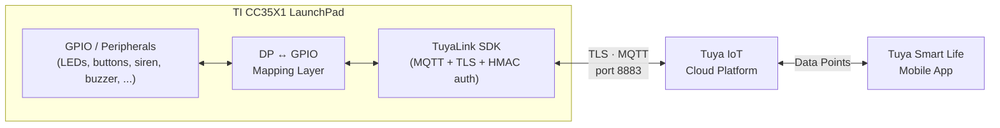

# Tuya × TI SimpleLink — Cloud-Connected IoT on the CC35X1

## Table of Contents

- [Project Overview](#project-overview)
- [Demo Video](#demo-video)
- [Architecture / Project Breakdown](#architecture--project-breakdown)
- [Hardware Setup](#hardware-setup)
- [Getting Started](#getting-started)
- [Team & Acknowledgments](#team--acknowledgments)
- [License](#license)
- [Disclaimer](#disclaimer)

---

## Project Overview

This project integrates **Tuya's TuyaLink SDK** into **Texas Instruments' SimpleLink™ SDK**, enabling TI's **CC35X1** Wi-Fi microcontroller to connect to and be controlled through the **Tuya IoT Platform** and the **Tuya Smart Life** mobile app.

**TuyaLink** is Tuya's hardware-agnostic **cloud connectivity protocol** (MQTT-based) for authenticating a device to Tuya's cloud, exchanging data points (DPs) with it, and driving/reading real GPIO hardware from a mobile app in real time.

This repository is built **on top of TI's `network_terminal` example application**, the reference Wi-Fi/BLE bring-up app shipped with the TI SimpleLink™ Wi-Fi CC35XX SDK (FreeRTOS, TI-CLANG toolchain, lwIP, TI mbedTLS). The Tuya/TuyaLink integration is added as an additional application layer on top of that existing example, reusing its Wi-Fi connection management and command-line infrastructure rather than replacing it.

**Goal:** demonstrate a full, end-to-end IoT pipeline — real hardware → secure authenticated cloud connection → consumer-facing mobile app control — running entirely on TI silicon and FreeRTOS.

This is a **BSc Computer Science final project at Ariel University**, developed in collaboration with **Texas Instruments (TI)**.

---

## Demo Video

*Click the thumbnail above to watch the full demo.*

> Placeholder: replace `docs/demo-thumbnail.png` and the video link once the final demo recording is available.

---

## Architecture / Project Breakdown

This repository implements **TuyaLink via MQTT** in the TI `network_terminal` example, using the **pre-activated MQTT path**.

- The device authenticates to the Tuya broker (`m1.tuya*.com:8883`) via **TLS + HMAC-signed MQTT CONNECT**, using a pre-registered device ID + secret (no pairing/QR flow required).
- SNTP time sync, TLS handshake (TI mbedTLS), and MQTT session handling are implemented as TI-platform glue around Tuya's protocol-layer C library (`tuya-iot-core-sdk`).
- A **table-driven DP ↔ GPIO mapping layer** connects Tuya data points to board hardware — any data point defined on the Tuya product can be wired to any GPIO/peripheral in either direction, simply by adding an entry to the mapping table. No changes to the cloud connectivity or MQTT logic are required to add new I/O.
  - **Cloud → board:** boolean DP writes drive an output (e.g. an LED).
  - **Board → cloud:** a physical input event (e.g. a debounced button press) reports back as an updated DP.
- **Example implemented in this repo:** a boolean `alarm` DP drives a live siren feature — two external LEDs flashing in antiphase plus a buzzer — fully controllable from the Tuya Smart Life app, demonstrating the general DP ↔ hardware pattern above.
- Verified working on the TI **LP-EM-CC35X1** LaunchPad.

---

## Hardware Setup

The base demo (LED + button DPs) runs entirely on the LP-EM-CC35X1 LaunchPad's onboard LEDs and buttons — no wiring required.

The **siren/alarm demo** additionally drives two external LEDs and an active buzzer, wired to free GPIO pins on the LaunchPad's BoosterPack header (with a current-limiting resistor for the LEDs and a shared ground). Exact pin assignments are defined in `network_terminal.syscfg` (`CONFIG_GPIO_SIREN_RED`, `CONFIG_GPIO_SIREN_BLUE`, `CONFIG_GPIO_SIREN_BUZZER`) and can be reassigned there to fit your own wiring.

---

## Getting Started

> The steps below are placeholders — fill in exact SDK versions, paths, and IDs used for your build.

### Prerequisites

- **Code Composer Studio (CCS)** with the TI-CLANG toolchain.
- **TI SimpleLink™ Wi-Fi CC35XX SDK** (version `10.10.01.08`).
- **TI SysConfig** (bundled with CCS / SDK).
- **XDS110** debug probe (onboard the LP-EM-CC35X1 LaunchPad).
- A **Tuya IoT Platform** account with a pre-activated device (Device ID + Device Secret) and product data points (DPs) configured — see [Creating a Tuya Product](https://github.com/TI-Tuya-Project/.github/blob/main/GUIDE_CREATE_TUYA_PRODUCT.md) for step-by-step setup.

### Building

1. Open **Code Composer Studio** and import this project (`network_terminal_LP_EM_CC35X1_freertos_ticlang`).
2. Fill in your Tuya device credentials in `tuya_config.h` (`TUYA_DEVICE_ID`, `TUYA_DEVICE_SECRET`, broker host).
3. Configure your Wi-Fi network(s) in `network_terminal.c`.
4. Open `network_terminal.syscfg` and verify the GPIO pin assignments match your board wiring.
5. **Project → Build.**

### Flashing

1. Connect the LaunchPad via USB (XDS110 debug probe).
2. **Run → Debug**, or use the CCS flash/load action.
3. Open a serial terminal (XDS110 UART) to view boot and connection logs.

---

## Team & Acknowledgments

### Team

| Name | LinkedIn |
|---|---|
| Gal Maymon | [linkedin.com/in/gal-maymon-a3881a244](https://www.linkedin.com/in/gal-maymon-a3881a244/) |
| Or Bibi | [linkedin.com/in/or-bibi](https://www.linkedin.com/in/or-bibi/) |
| Samuel Lazareanu | [linkedin.com/in/samuellazareanu](https://www.linkedin.com/in/samuellazareanu/) |
| Amit Nachum | [linkedin.com/in/amit-nachum-003992354](https://www.linkedin.com/in/amit-nachum-003992354/) |

### Acknowledgments

We gratefully acknowledge the guidance and support of:

- **TI Engineers:** Dan Horowitz and Israel Zilbershmidet
- **University Professor:** Prof. Amit Dvir

---

## License

This project is built on the **TI SimpleLink™ Wi-Fi CC35XX SDK** and is distributed under its terms. See [`LICENSE.txt`](LICENSE.txt) (TI SimpleLink SDK license, included in this repository) for the full text.

---

## Disclaimer

This is an academic final project created by students. It is not an official Texas Instruments product, and the contributors do not represent Texas Instruments.
